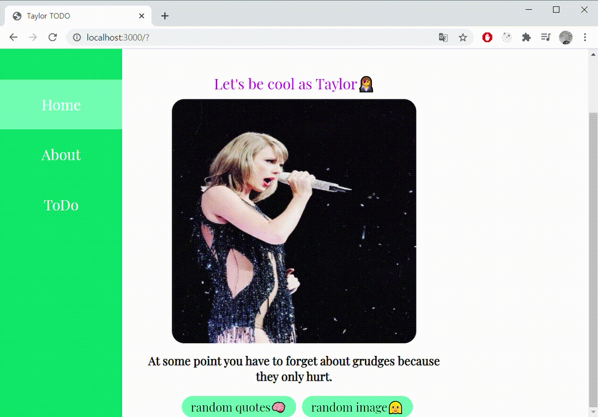
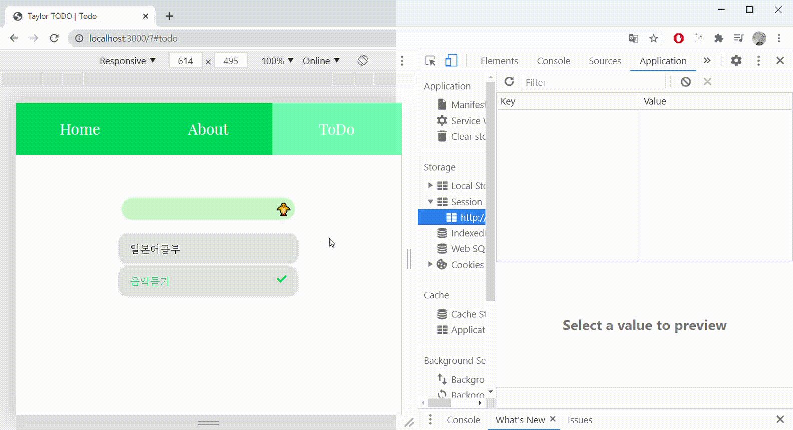
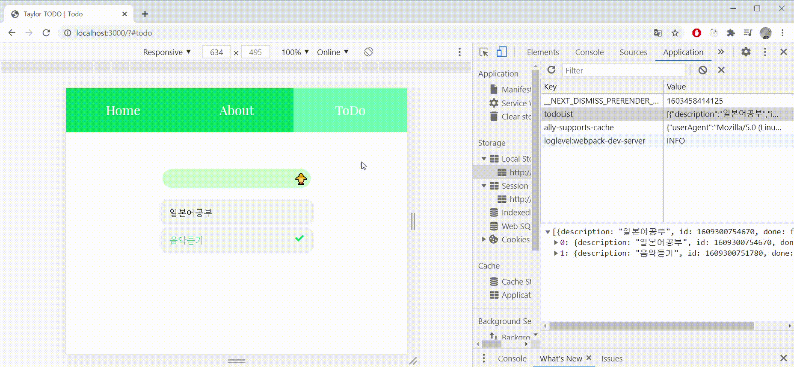
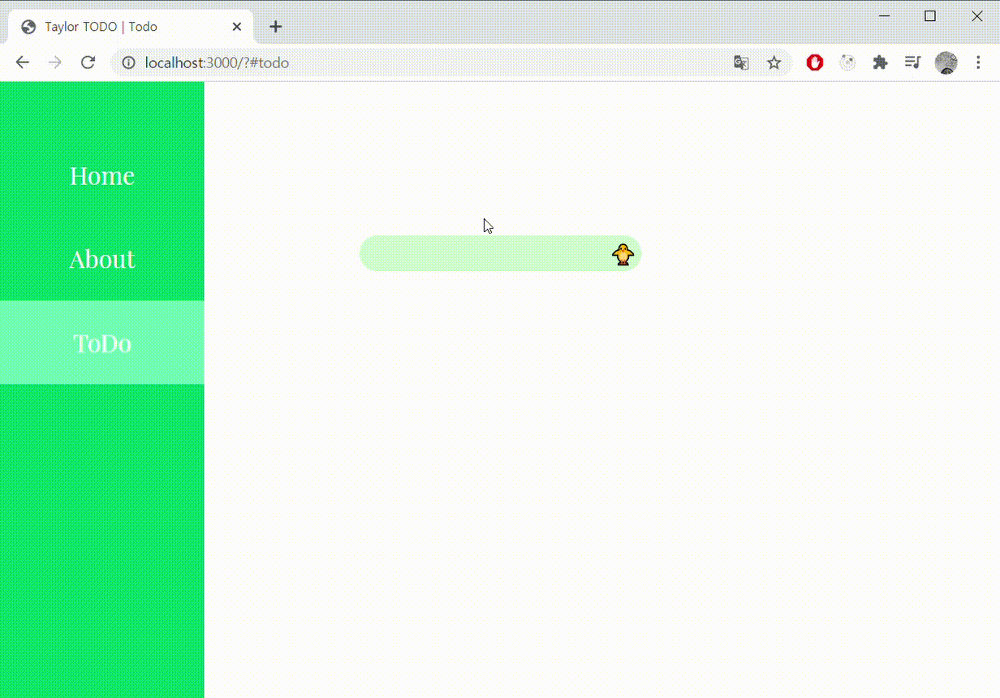

# vanilla JavaScript로 만든 투두리스트

-   타입스크립트 사용
-   webpack으로 ts 파일 번들링
-   라우터를 직접 구현하여 해쉬 방법으로 페이지 라우팅 구현 [블로그 포스팅 - 라우터 구현 정리](https://mooneedev.netlify.app/Frontend/%EB%B0%94%EB%8B%90%EB%9D%BC%EC%9E%90%EB%B0%94%EC%8A%A4%ED%81%AC%EB%A6%BD%ED%8A%B8%EB%A1%9C%20%EB%A6%AC%EC%95%A1%ED%8A%B8%20%EB%94%B0%EB%9D%BC%EC%9E%A1%EA%B8%B0/)
-   페이지별로 들어갈 컨텐츠를 컴포넌트로 구현 ( Index > App > Pages > Components )

## Quick start

```javascript
git clone https://github.com/moonheekim0118/vanillaReact
npm run test // 테스팅
npm run start // 빌드 + 서버 구동

// localhost:3000 에서 확인 가능
```

<br/>

## Home page



1. (..덕심을 담아) 테일러 스위프트 사진과 명언을 보여줌 - [taylor rest api](https://taylor.rest/) 사용

2. 버튼 컴포넌트를 이용하여 onClick 이벤트를 이용해 사진 또는 명언을 바꿀 수 있도록 함

<br/>

## Todo page

<br/>



1. **입력창에 입력한 내용**은 제출하지 않은 경우 **sessionStorage**에 저장. 이 때, 모든 Input 이벤트에 따라 sessionStorage를 업데이트 하지않고 디바운싱을 이용하여 900ms동안 input 이벤트가 없을 경우에만 sessionStorage에 저장하도록 구현.



2. **투두리스트**는 **localStorage**에 저장. description과 id 그리고 done 여부를 저장




3. todo done 체크 / 삭제 구현
4. 드래그 앤 드랍을 구현하여 투두리스트 순서를 바꿀 수 있도록 구현

<br/>
